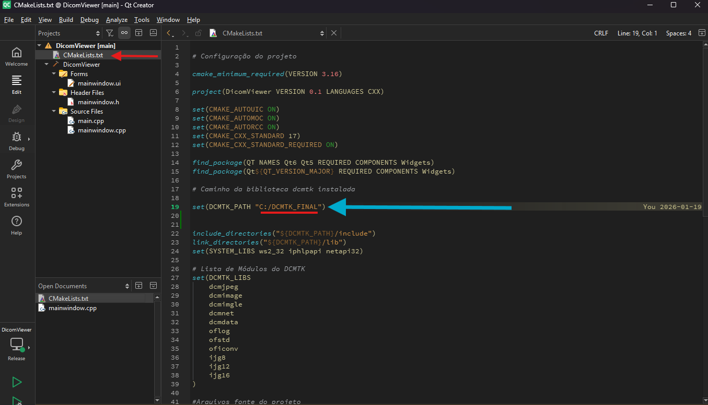
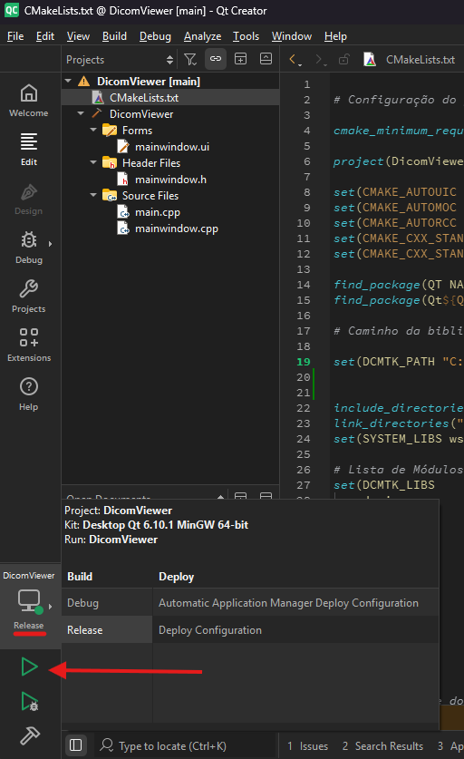
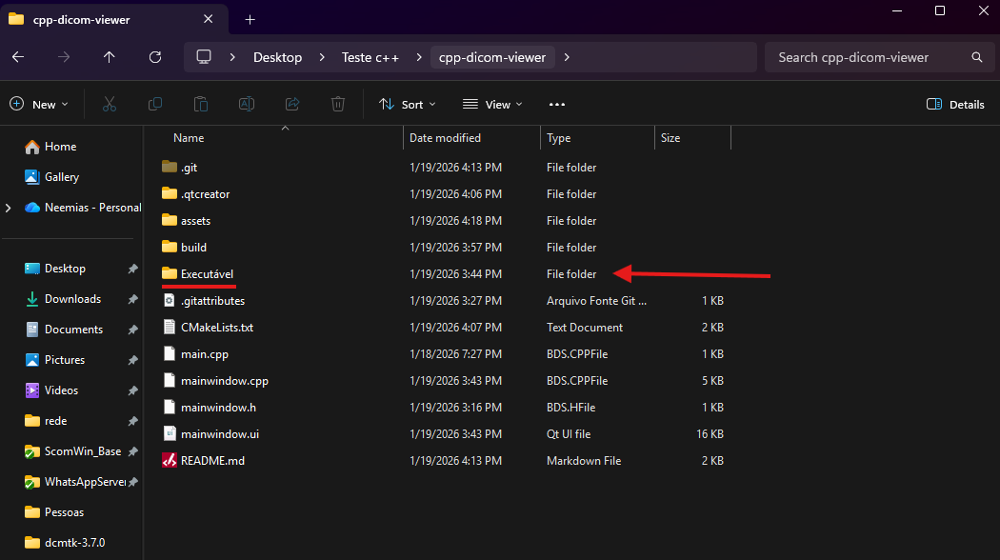
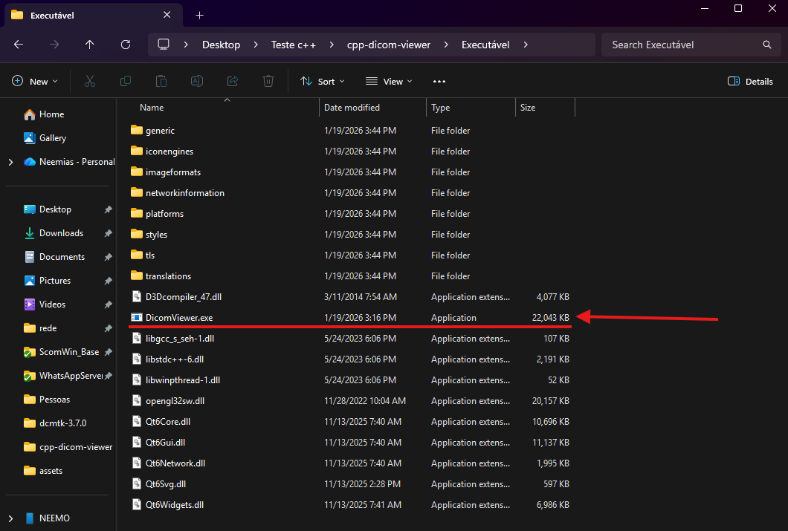

# C++ DICOM Viewer

Um visualizador de imagens médicas desenvolvido em **C++17** utilizando **Qt 6** e a biblioteca **DCMTK** (DICOM Toolkit).

## 🚀 Funcionalidades 🚀

Este projeto resolve desafios comuns no processamento de imagens médicas:

* **Leitura DICOM:** Suporte a arquivos DICOM brutos e comprimidos (JPEG/RLE) via codecs registrados.
* **Extração de Metadados:** Extração e formatação automática de tags DICOM (Nome, ID, Modalidade, Data, Equipamento).
* **Renderização:** Aplicação automática de **Brilho/Contraste** baseada nos presets do exame.
* **Interface Responsiva:** O visualizador mantém o *Aspect Ratio* correto e se adapta ao redimensionamento da janela.

## 🛠️ Tecnologias Utilizadas 🛠️

* **Linguagem:** C++ (Standard 17)
* **GUI:** Qt 6 (Widgets Module)
* **Biblioteca DICOM:** DCMTK 3.7.0
* **Build System:** CMake & Ninja/MinGW

## ⚙️ Como Executar projeto através do Qt 6 ⚙️

### Pré-requisitos
* [Qt 6](https://www.qt.io/development/download-qt-installer-oss) instalado.
* Biblioteca [DCMTK](https://dicom.offis.de/download/dcmtk/dcmtk370/) compilada e linkada corretamente.
* Compilador MinGW 64-bit ou MSVC.

### Execução pelo Qt 6 (Windows)
1.  Clone o repositório.
2.  Abra o projeto na IDE Qt 6.
3.  Configure o caminho do DCMTK no `CMakeLists.txt`.

4.  Compile em modo **Release**.

## ⚙️ Execução pelo executável presente no repositório ⚙️

1. Clone o repositório.
2. Abra a pasta "Executável"

3. Execute o arquivo "DicomViewer.exe"

   
  

